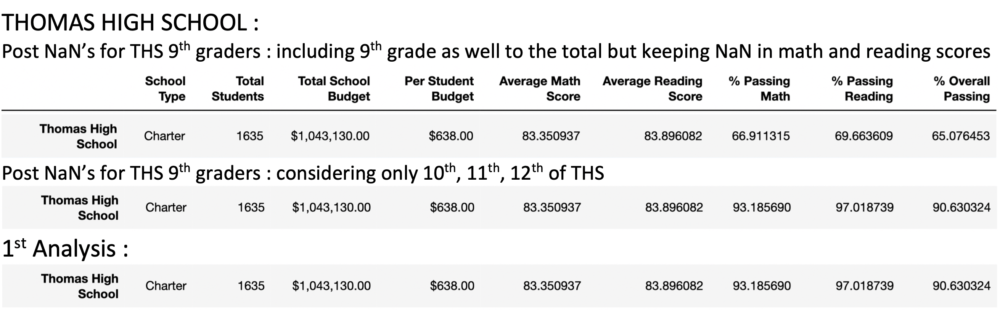
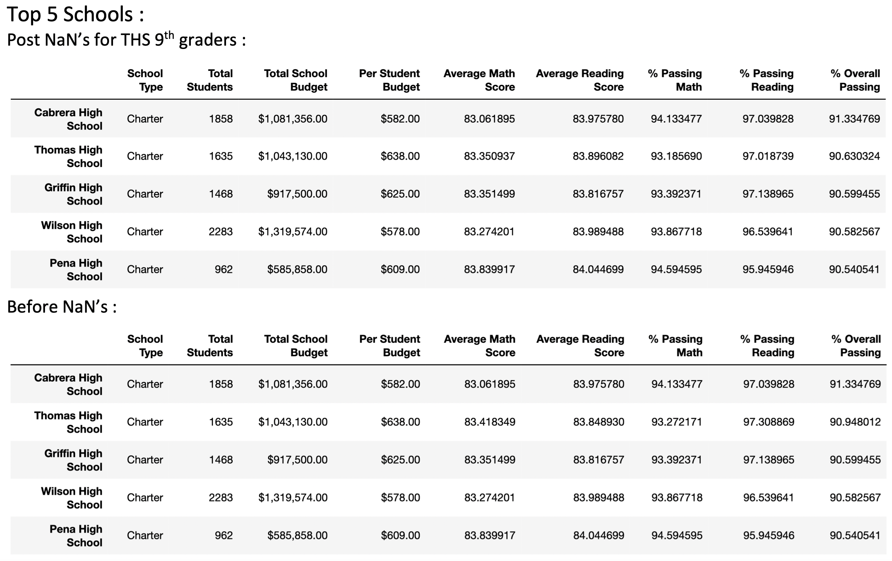

# **School District Analysis**
- Analyse the school data to help decide on school budget using Pandas on Jupyter Notebook.
---
## Overview of the Project :
- School data was analysed to report out on the basis of District Summary, School Summary, Top 5 and Bottom 5 Schools, Average Math and Reading scores for each grade level, Scores by School spending per student, Scores by School size, Scores by School type.
- Post the 1st round of completion of analysis, it was discovered that the data was altered for 9th grade for Thomas High School (THS). So to uphold the state-testing standards, the data had to be cleaned by replacing NaN's in place of math and reading scores for 9th grade Thomas High school data. 
- After the data is curated, complete analysis has to be repeated to understand the effect of this on overall school data analysis.
- The complete screenshots of the required dataframe results from School data analysis can be viewed in the document (docx) file kept under Resources folder. This hyperlink can be clicked to open the same :   <a href="https://github.com/VinuthaBS/School_District_Analysis/blob/main/Resources/School_Analysis_Screenshots.docx">------> School Analysis Screenshots document</a>
## **School Data Analysis Results**
- After replacing NaN's for the math and reading scores of Thomas High School 9th graders, the complete analysis was repeated. So we have scope for comparison between the 2 analysis. 
- The District summary was not affected much as the number of 9th graders whose data wasnt counted for the 2nd analysis was around 450+ but the total student count that we dealt with was very big around 39000+ records. We observe only a variation in district summary values getting reduced by 0.1 to 0.3 which is very much negligible. District summary stats stayed almost intact.
- When we analysed School summary where each school data was analysed separately we definitely see the impact of altered data. When count of 9th graders was included in the total count of students for THS but keeping the NaNs in the performance data, the % values dropped almost 30% to the order of around 65%. But if we analyse the data including 9th graders for total count but not have the right performance data associated with them, then its not a fair performance analysis. 
- </img>
- When only the 10th, 11th, 12th total students and only these grades math and reading scores were considered, again the performance trends similarity of what we had seen in the 1st analysis with the altered data for THS 9th graders. 
- This shows that school performance stayed almost same for 10th, 11th, 12th when compared with 1st analysis with altered data for 9th graders. This raises a question if the news on altered data for 9th graders THS was really true? When the school gives a performance of 90%+ for 10th, 11th and 12th grades and the data of these 3 classes were believed to be true, most likely the same school might have given similar % performance even for 9th graders. The part on the news about data being altered for 9th graders alone, will have to scrutinised thoroughly. 
- </img>
-  To validate the above analysis when we look at Top 5 performing schools, the Thomas High school retains its position of Top 2nd place even in 2nd analysis without altered data. The Top 5 schools before and after look almost the same except for very minute % value changes for THS.
- Average Math and Reading scores by grade for each school surely has a major impact as all the data for THS 9th graders is "NaN". The same NaN is reflected in the table for THS 9th graders in the 2nd analysis. 
- As we were told and believe only the math and reading score of 9th grade THS were altered, there is no impact on the Scores by School spending, or School Size or School Type dataframes. They all remain intact before and after and look exactly same. 9th grade student count remains same for all these cases as total student count of the Thomas High school doesnt change in anyway due to this altered performance data. 
## **Summary**
- Based on above analysis and results we can infer that unless and untill the analysis talks about the math or reading score at grade level for each school, we dont see much impact on our analysis.
- As the altered data is just a small subset when compared to complete dataset, overall analysis was not impacted noticeably especially on the District summary. Almost 1% was altered data in above case.
- As the overall performance trend of THS without 9th graders data remains same, raises questions on the source of the news on altered data and its validity.
- It was a good case where in the performance trend of a school was validated for 2 sets of grades. If the 2nd analysis dint follow the same trend as 1st analysis for THS, then THS couldnt have maintained its 2nd place in Top 5 performing schools. 
- There is a takeaway wherein if data has to be analysed on fair grounds, attention should be paid on the data to be omitted or included for the analysis. Like in above case, including THS 9th grader for student total but keeping NaN for scores would have resulted in an unfair analysis. 